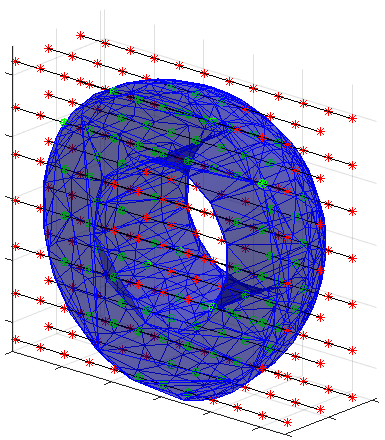

# InsidePolyhedron  

Fast C++ library to check which of a set of 3D-points on a grid are inside and which are outside of one or more closed surfaces defined by a  polyhedron. Includes an interface for Matlab&trade; using the mex-framework. 


The repository is in the form of a visual studio project. To compile on another platform/with a different compiler, you only need the files IsInsideOfPolyhedron.cpp, IsInsideOfPolyhedron.h and DynamicArray.h. If you are compiling for Matlab, you will need insidepoly_mexfunction.cpp as well.

The main function has the following interface:

```c++
/**
\brief Check whether a set of points on a 3D-grid is inside or outside a surface defined by a polyhedron.
This function uses ray-tracing to determine whether or not a point is inside the surface. Since the points
to be checked are aligned on a grid, we can reuse information for each point to perform the calculation
significantly faster than if we were to check each point individually.
\param inside[out] Boolean array of output values, must be large enough to contain nx*ny*nz values. The result corresponding to the coordinate (x[i], y[j], z[k]) is found
in inside[(j * nx * ny) + (i * ny) +  k]. The reason for this configuration is to align with Matlab's meshgrid(x, y, z) function.
\param vertices[in] Array of vertices in the polyhedron. Each vertex consists of 3 coordinates, x, y and z, therefore this is an n x 3 array.
\param faceIndices[in] Definition of the triangular faces of the surface. Each row of this matrix consists of three indices into the vertex-list, which together define
a triangular face.
\param nFaces Number of faces in the surface (size of faceIndices)
\param x X-coordinate values on the grid to be checked.
\param nx Number of X-coordinates
\param y Y-coordinate values on the grid to be checked.
\param ny Number of Y-coordinates
\param z Z-coordinate values on the grid to be checked.
\param nz Number of Z-coordinates
*/
void insidePolyhedron(bool inside[], const double vertices[][3], const int faceIndices[][3], size_t nFaces, const double x[], size_t nx, const double y[], size_t ny, const double z[], size_t nz);

```

 The function relies on ray-tracing. For every point, a ray extending  from this point in any direction will cross an odd number of faces if the point is inside the surface, and an even number of faces if it is outside. This technique will work even if the structure defines multiple surfaces, but all surfaces must be closed.

The key to the speedup of checking points on a grid compared to checking points individually comes from reducing the number of faces we need to check for each point. For every plane  (*x, y, z<sub>0</sub>*) , we need check only those faces that cross *z<sub>0</sub>*, and for every line (*x, y<sub>0</sub>, z<sub>0</sub>*) in that plane we need only to check those faces that also cross *y<sub>0</sub>*. Finally, we only need to check where each of these faces crosses the line *once* in order to check *every* point on the line. 

## Matlab interface

I = InsidePolyhedron(V, F, x, y, z) returns a 3-dimensional boolean array where I(i, j, k) is true if and only if the point (y(i), x(j), z(k)) is inside the polyhedron surface. The dimensions of I are (length(y), length(x), length(z)), which corresponds to the size of the arrays returned by meshgrid(x, y, z). 

I = InsidePolyhedron(V, F, x, y, z, useDithering) adds a tiny bit of noise to the vertex coordinates if useDithering is True. This can usually solve issues where one or more of the triangular faces are parallel to the traced ray, which in other circumstances would make the ray-tracing algorithm fail. This problem may occur when the vertices of the surface are themselves aligned on a grid. Points that lie exactly on (or numerically indistingushable from) the surface will end up being randomly assigned as inside or outside the surface.

V is an n by 3 matrix of vertices on the surface. Each row consists of the x, y and z coordinates of a vertex. F is an m by 3 matrix of indices into the rows of V. Each row of F defines a triangular face defined by three vertices. This is the same format as returned by surf = isosurface(...), which returns a struct with the fields surf.vertices and surf.faces.

The arguments x, y, and z are vectors of x, y and z coordinates respectively. This function exploits the fact that the points to be checked are on a grid in order to speed up processing significantly. The points checked by InsidePolyhedron are those that are on the grid defined by [X, Y, Z] = meshgrid(x, y, z). Note, however, that the input arguments are the vectors x, y and z, not the 3-dimensional arrays  X, Y and Z.

Example:

```matlab
  dx = 0.1;
  x = -7:dx:7;y = -7:dx:7; z = -7:dx:7;
  [X, Y, Z] = meshgrid(x, y, z);

  %Create a logical array where points inside a radius of 5 are assigned true.
  I0 = sqrt(X.^2 + Y.^2 + Z.^2) < 5;
  %Turn it into a smooth function for use in isosurface
  I0smooth = smooth3(I0, 'box', 5);
  %Find the isosurface as a polyhedron
  surface = isosurface(X, Y, Z, I0smooth, 0.5);

  %Use InsidePolyhedron to find points inside and outside the surface.
  %Since the grid we check is the same that we used to generate the
  %surface, we will need to use dithering to get a good result.
  I1 = InsidePolyhedron(surface.vertices, surface.faces, x, y, z, true);

  %Show a slice of the result
  imagesc(x, y, I1(:,:,50));
  axis equal;
```


[](https://se.mathworks.com/matlabcentral/fileexchange/80476-insidepolyhedron)

